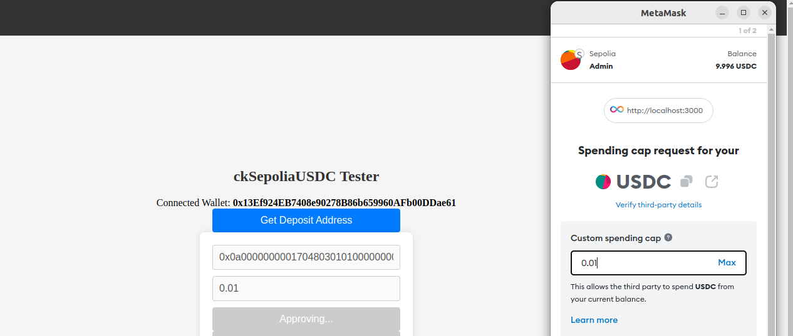
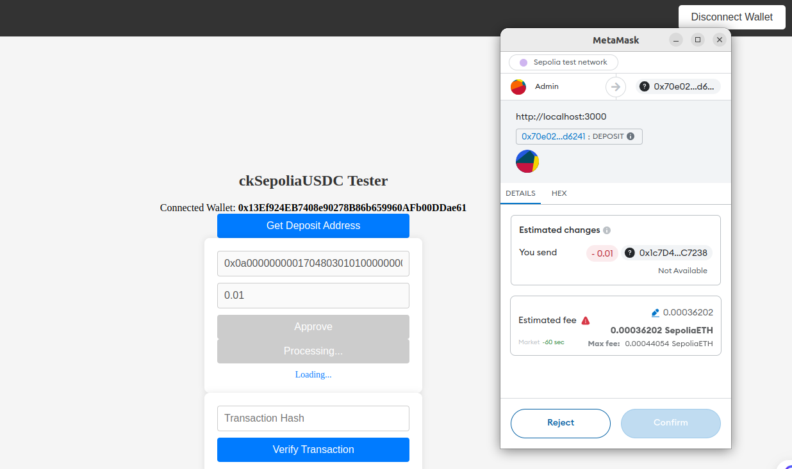

# ckERC-20 Tutorial

This tutorial shows how you can intergrate ckERC-20 tokens on your dApp

## Prerequisites
Before we begin, ensure you have the following:

- You've installed [necessary environment requirements](https://internetcomputer.org/docs/current/developer-docs/getting-started/install/)
- [MetaMask](https://metamask.io/download/) installed in your browser with [Sepolia USDC (testnet) tokens](https://faucet.circle.com/)
- Basic knowledge of rust

## Getting started 
You can clone the starter template that comes with the default EVM intergration on the frontend - and backend in Rust

```bash 
git clone https://github.com/Stephen-Kimoi/starter-template.git
```

#### Note: We'll be implementing ckSepoliaUSDC for this tutorial

## Important Links/Recources: 
1. Sepolia USDC from the faucet - [Link](https://faucet.circle.com/)
2. Sepolia USDC Contract Address - [Link](https://sepolia.etherscan.io/token/0x1c7D4B196Cb0C7B01d743Fbc6116a902379C7238)
3. ckSepoliaUSDC Helper Contract Address - [Link](https://sepolia.etherscan.io/address/0x70e02Abf44E62Da8206130Cd7ca5279a8F6d6241)
4. USDC_LEDGER: ``"2s5qh-7aaaa-aaaar-qadya-cai"``; 
5. ckETH_MINTER: ``"jzenf-aiaaa-aaaar-qaa7q-cai"``;

## Frontend Logic: 

### 1. `SepoliaUSDCAddress`
The `SepoliaUSDCAddress` is a constant that stores the address of the Sepolia USDC contract on the Ethereum network. This address is used for interacting with the USDC contract, such as approving the helper contract to spend tokens on behalf of the user.

**Code Example**
```javascript
const SepoliaUSDCAddress = "0x1c7D4B196Cb0C7B01d743Fbc6116a902379C7238";
```

### 2. `erc20ABI`
This array defines the Application Binary Interface (ABI) for interacting with the ERC20 `approve` function. The `approve` function allows a spender to withdraw from the caller's account multiple times, up to the specified amount.

**Code Example**
```javascript
const erc20ABI = [
  {
    "constant": false,
    "inputs": [
      {
        "name": "_spender",
        "type": "address"
      },
      {
        "name": "_value",
        "type": "uint256"
      }
    ],
    "name": "approve",
    "outputs": [
      {
        "name": "",
        "type": "bool"
      }
    ],
    "type": "function"
  }
];
```

### 3. `depositAddress`
This function retrieves the deposit address from the backend canister on the Internet Computer. This address is used to deposit Sepolia USDC tokens.

**Code Example**
```javascript
const depositAddress = async () => {
  const depositAddress = await cketh_starter_backend.canister_deposit_principal();
  setCanisterDepositAddress(depositAddress);
};
```

### 4. `approve`
This function allows the helper contract to spend a specified amount of Sepolia USDC on behalf of the user. It utilizes the `useContractWrite` hook from `wagmi` to interact with the Sepolia USDC contract’s `approve` function.

**Code Example**
```javascript
const { write: approve, isLoading: isApproveLoading } = useContractWrite({
  address: SepoliaUSDCAddress,
  abi: erc20ABI,
  functionName: "approve",
  args: [helperContractAddress, amount],
  onSuccess(data) {
    toast.info("Approval successful. You can now proceed with the deposit.");
    console.log("Approval data is: ", data);
  },
  onError(error) {
    toast.error("Approval failed");
    console.error(error);
  }
});
```

### 5. `deposit` 
This deposit function calls the `deposit` method of the helper contract to deposit Sepolia USDC tokens from the user's wallet to the canister deposit address. It also uses the `useContractWrite` hook from `wagmi`.

**Code Example**
```javascript
const { write: deposit, data, isLoading: isDepositLoading } = useContractWrite({
  address: helperContractAddress,
  abi: abi,
  functionName: "deposit",
  args: [SepoliaUSDCAddress, amount, canisterDepositAddress],
  onSuccess(data) {
    toast.info("Depositing Sepolia USDC");
  },
  onError(error) {
    toast.error("Deposit failed");
    console.error(error);
  }
});
```

### 6. `verifyTransaction`
This function verifies a transaction on the Ethereum blockchain by interacting with the backend canister on the Internet Computer. It checks whether the transaction was successfully recorded on-chain.

**Code Example**
```javascript
const verifyTransaction = async (hash) => {
  setIsVerifying(true); // Start loading
  setVerificationError(null); // Reset error state

  try {
    const result = await cketh_starter_backend.verify_transaction(hash);
    setVerificationResult(result); // Store the verification result
    toast.success("Transaction verified successfully");
  } catch (error) {
    setVerificationError("Verification failed. Please check the transaction hash and try again.");
    toast.error("Verification failed");
    console.error(error);
  } finally {
    setIsVerifying(false); // Stop loading
  }
};
```

## Step 1: Generating byte32 address from Principal ID
The first step is to create a function that converts a Principal ID into a byte32 address. This is necessary as it is the argument required for depositing ckUSDC.

First of all you add the following dependency to ``Cargo.toml`` file inside the backend directory
```
b3_utils = { version = "0.11.0", features = ["ledger"] }
```

Then you can insert the rust function to your ``lib.rs`` file: 
```rust 
use b3_utils::{vec_to_hex_string_with_0x, Subaccount};

#[ic_cdk::query]
fn canister_deposit_principal() -> String {
    let subaccount = Subaccount::from(ic_cdk::id());

    let bytes32 = subaccount.to_bytes32().unwrap();

    vec_to_hex_string_with_0x(bytes32)
}
```

## Step 2: Minting ckUSDC tokens to the principal ID
Once you have the deposit principal, the next step is to convert USDC to cUSDC tokens

These are the steps to follow: 
1. Submit an Ethereum transaction calling the ``approve`` function of the ERC-20 smart contract to allow the helper smart contract to withdraw some of the user's funds.


2. Call the ``deposit`` function of the [helper smart contract](https://sepolia.etherscan.io/address/0x70e02Abf44E62Da8206130Cd7ca5279a8F6d6241), specifying the following arguments: 
  - ERC-20 contract
  - How many ERC-20 tokens should be withdrawn from the user's account and, 
  - The principal ID(in byte32 address format) that should be credited for the minted ckERC20 tokens


## Step 3: Fetching the canister's ckUSDC Balance
We will need to import the following structs from the ``b3_utils::ledger`` and ``b3_utils::api`` dependencies:

```rust 
use b3_utils::ledger::{ICRCAccount, ICRC1, ICRC1TransferArgs, ICRC1TransferResult};
use b3_utils::api::{InterCall, CallCycles}; 
```

We also define the ``LEDGER`` canister ID that is responsible for storing balances of the pricipal IDs

```rust 
const USDC_LEDGER: &str = "2s5qh-7aaaa-aaaar-qadya-cai"; 
```

Now let's insert the function for checking the balance 
```rust 
#[ic_cdk::update]
async fn balance(principal_id: Principal) -> Nat {
  let account = ICRCAccount::new(principal_id, None);

  ICRC1::from(USDC_LEDGER).balance_of(account).await.unwrap()
}
```

## Step 4: Converting ckUSDC tokens back to USDC:
We define the ``ckETH MINTER`` and ``ckETH LEDGER`` canister IDs. This is because we'llneed to approve the ``ckETH Minter`` to burn some of the user's ``ckETH`` tokens as payment for transaction fees

```rust 
const CKETH_LEDGER: &str = "apia6-jaaaa-aaaar-qabma-cai";
const CKETH_MINTER: &str = "jzenf-aiaaa-aaaar-qaa7q-cai";
```

We now import ``ICRC2ApproveArgs`` & ``ICRC2ApproveResult`` from the ``b3_utils::ledger::`` package 
```rust 
use b3_utils::ledger::{ICRC2ApproveArgs, ICRC2ApproveResult}
```

Call the ``icrc2_approve`` function on the ``ckETH ledger`` to approve the ckETH minter to ``burn some of the user's ckETH tokens as payment`` for the transaction fees.
```rust 
#[ic_cdk::update] 
async fn approve_cketh_burning(user_principal: Principal, amount: Nat) -> ICRC2ApproveResult {
    let from_subaccount = Subaccount::from(user_principal);
    
    // Use the ckETH minter as the spender
    let minter_principal = Principal::from_text(CKETH_MINTER).expect("Invalid minter principal");
    let spender = ICRCAccount::new(minter_principal, None);

    let approve_args = ICRC2ApproveArgs {
        from_subaccount: Some(from_subaccount), 
        spender, 
        amount, 
        expected_allowance: None,
        expires_at: None,
        fee: None, 
        created_at_time: None, 
        memo: None 
    }; 

    InterCall::from(CKETH_LEDGER).call(
        "icrc2_approve", 
        approve_args, 
        CallCycles::NoPay
    )
    .await 
    .unwrap()
}
```

The next step is to call the ``icrc2_approve`` function on the ``USDC_LEDGER`` to ``approve the minter`` to ``burn`` some of the ``user's ckUSDC`` tokens.

```rust 
#[ic_cdk::update]
async fn approve_usdc_burning(user_principal: Principal, amount: Nat) -> ICRC2ApproveResult {
    let from_subaccount = Subaccount::from(user_principal);
    
    // Convert minter Principal to ICRCAccount
    let minter_principal = Principal::from_text(CKETH_MINTER).expect("Invalid minter principal");
    let spender = ICRCAccount::new(minter_principal, None);

    let approve_args = ICRC2ApproveArgs {
        from_subaccount: Some(from_subaccount),
        spender,
        amount,
        expected_allowance: None,
        expires_at: None,
        fee: None,
        created_at_time: None,
        memo: None
    };

    InterCall::from(USDC_LEDGER).call(
        "icrc2_approve",
        approve_args,
        CallCycles::NoPay
    )
    .await
    .unwrap()
}
```

Now the final function is to withdraw, we call the ``withdraw_erc20`` function on the ``ckETH minter``, specifying:
- Canister ID of the ledger for ckUSDC
- The amount to be withdrawn
- The Ethereum destination address.

Add the withdraw struct arguments
```rust 
#[derive(candid::CandidType, serde::Deserialize)]
struct WithdrawErc20Args {
    ckerc20_ledger_id: Principal,
    recipient: String,
    amount: Nat,
}

#[derive(candid::CandidType, serde::Deserialize)]
struct WithdrawErc20Result {
    block_index: Nat,
}
```

```rust 
#[ic_cdk::update]
async fn withdraw_ckusdc_to_ethereum(amount: Nat, eth_address: String) -> WithdrawErc20Result {
    let args = WithdrawErc20Args {
        ledger: Principal::from_text(USDC_LEDGER).expect("Invalid USDC ledger principal"),
        amount,
        recipient: eth_address,
    };

    InterCall::from(CKETH_MINTER).call(
        "withdraw_erc20",
        args,
        CallCycles::NoPay
    )
    .await
    .unwrap()
}
```

### Note: You will need cycles for interacting with some of the functions since you're interacting with canisters that are deployed on mainnet.

## Important links: 
- Official ckERC20 Documentation - [Link](https://internetcomputer.org/docs/current/developer-docs/multi-chain/chain-key-tokens/ckerc20/overview)
- Ledger Suit Orchestrator Documentation - [Link](https://github.com/dfinity/ic/tree/master/rs/ethereum/ledger-suite-orchestrator)
- ckERC20 GitHub Page - [Link](https://github.com/dfinity/ic/blob/master/rs/ethereum/cketh/docs/ckerc20.adoc)
- 