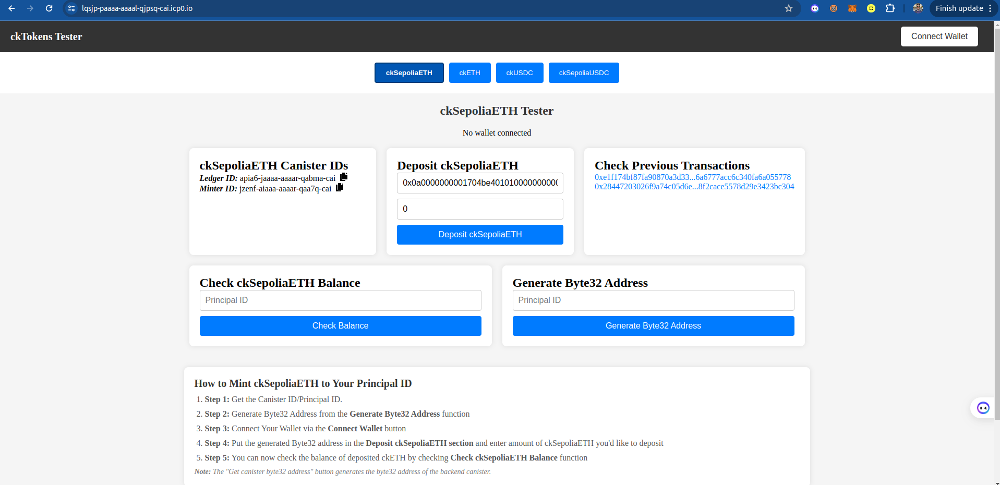

# ckERC-20 Tutorial

This tutorial shows how you can intergrate ckERC-20 tokens on your dApp

## ckTokens Minter: 
You can now easily mint ckSepoliaETH to your principal ID using this site - [Link](https://lqsjp-paaaa-aaaal-qjpsq-cai.icp0.io/)


## Prerequisites
Before we begin, ensure you have the following:

- You've installed [necessary environment requirements](https://internetcomputer.org/docs/current/developer-docs/getting-started/install/)
- [MetaMask](https://metamask.io/download/) installed in your browser with [Sepolia USDC (testnet) tokens](https://faucet.circle.com/)
- Basic knowledge of rust

## Getting started 
The repo containing the full code can is [here](https://github.com/Stephen-Kimoi/cketh-tutorial) 

Here's the file structure: 
```
src|
   ...
   |_cketh_tutorial_frontend
     ... 
     |_src 
       |_components
         |_Header 
           ...
           |_CKSepoliaUSDC // Code is located here
           ...
```         

#### Note: We'll be implementing ckSepoliaUSDC for this tutorial

## Frontend Logic Documentation

### 1. `SepoliaUSDCAddress`
The `SepoliaUSDCAddress` is a constant that stores the Ethereum contract address for the Sepolia USDC token. This address is crucial for interacting with the USDC contract, such as when approving transactions or making deposits.

**Code Example**
```javascript
const SepoliaUSDCAddress = "0x1c7D4B196Cb0C7B01d743Fbc6116a902379C7238";
```

### 2. `erc20ABI`
This array defines the Application Binary Interface (ABI) for interacting with the ERC20 `approve` function. The `approve` function allows a spender (typically another contract) to withdraw tokens from the user's account, up to a specified amount.

**Code Example**
```javascript
const erc20ABI = [
  {
    "constant": false,
    "inputs": [
      {
        "name": "_spender",
        "type": "address"
      },
      {
        "name": "_value",
        "type": "uint256"
      }
    ],
    "name": "approve",
    "outputs": [
      {
        "name": "",
        "type": "bool"
      }
    ],
    "type": "function"
  }
];
```

### 3. `ckSepoliaUSDCID`
The `ckSepoliaUSDCID` function fetches the canister IDs (Ledger and Minter) for the ckSepoliaUSDC tokens from the backend canister on the Internet Computer. These IDs are necessary for managing and minting ckSepoliaUSDC tokens.

**Code Example**
```javascript
const ckSepoliaUSDCID = async () => {
  const ledgerCanisterID = await cketh_tutorial_backend.ck_sepolia_usdc_ledger_canister_id();
  setSepoliaUSDCLedgerid(ledgerCanisterID); 

  const minterCanisterID = await cketh_tutorial_backend.ck_sepolia_eth_minter_canister_id();
  setSepoliaUSDCMinterid(minterCanisterID); 
};
```

### 4. `depositAddress`
The `depositAddress` function retrieves the deposit address (in Byte32 format) from the backend canister. This address is required for depositing Sepolia USDC tokens.

**Code Example**
```javascript
const depositAddress = async () => {
  const depositAddress = await cketh_tutorial_backend.canister_deposit_principal();
  setCanisterDepositAddress(depositAddress);
};
```

### 5. `approveSepoliaUSDC`
The `approveSepoliaUSDC` function allows the helper contract to spend a specified amount of Sepolia USDC on behalf of the user. It uses the `ethers.js` library to interact with the USDC contract’s `approve` function.

**Code Example**
```javascript
const approveSepoliaUSDC = async () => {
  setIsApproveLoading(true);
  try {
    const provider = new ethers.providers.Web3Provider(window.ethereum);
    const signer = provider.getSigner();
    const contract = new ethers.Contract(SepoliaUSDCAddress, erc20ABI, signer);

    const amountInSmallestUnit = ethers.utils.parseUnits(amount.toString(), 6);
  
    const tx = await contract.approve(MinterHelper.SepoliaUSDCHelper, amountInSmallestUnit);
    toast.info("Approving helper contract to spend Sepolia USDC");
    await tx.wait();
    toast.success("Approval successful. You can now proceed with the deposit.");
    console.log("Approval transaction data: ", tx);
  } catch (error) {
    toast.error("Approval failed");
    console.error(error);
  } finally {
    setIsApproveLoading(false);
  }
};
```

### 6. `depositSepoliaUSDC`
The `depositSepoliaUSDC` function first calls the `approveSepoliaUSDC` function to allow the helper contract to spend Sepolia USDC. Then, it deposits the approved tokens into the canister deposit address. The transaction hash is stored in the backend after a successful deposit.

**Code Example**
```javascript
const depositSepoliaUSDC = async () => {
  if (!walletConnected) {
    toast.error("Wallet not connected");
    return;
  }

  setIsDepositLoading(true);
  try {
    await approveSepoliaUSDC();
  
    const amountInSmallestUnit = ethers.utils.parseUnits(amount.toString(), 6);
  
    const provider = new ethers.providers.Web3Provider(window.ethereum);
    const signer = provider.getSigner();
    const contract = new ethers.Contract(MinterHelper.SepoliaUSDCHelper, abi, signer);
  
    const tx = await contract.deposit(SepoliaUSDCAddress, amountInSmallestUnit, canisterDepositAddress);
  
    toast.info("Depositing Sepolia USDC");
    await tx.wait();
    toast.success("Deposit successful");

    toast.info("Storing transaction hash...");
    await cketh_tutorial_backend.store_ck_sepolia_usdc_hash(tx.hash);
    toast.success("Transaction hash stored");

    fetchTransactionHashes();
  } catch (error) {
    toast.error("Operation failed");
    console.error(error);
  } finally {
    setIsDepositLoading(false);
  }
};
```

### 7. `fetchTransactionHashes`
The `fetchTransactionHashes` function retrieves and displays the stored transaction hashes for Sepolia USDC deposits. This allows users to track their previous transactions.

**Code Example**
```javascript
const fetchTransactionHashes = async () => {
  try {
    const hashes = await cketh_tutorial_backend.get_ck_sepolia_usdc_hashes();
    setTransactionHashes(hashes);
  } catch (error) {
    toast.error("Failed to fetch transaction hashes");
    console.error(error);
  }
};
```

### 8. `getReceipt`
The `getReceipt` function retrieves the transaction receipt for a given transaction hash by interacting with the backend. This receipt contains details about the transaction.

**Code Example**
```javascript
const getReceipt = async (hash) => {
  setIsReceiptLoading(true);
  try {
    const receipt = await cketh_tutorial_backend.get_receipt(hash);
    setSelectedReceipt(receipt);
    toast.success("Transaction receipt fetched");
  } catch (error) {
    toast.error("Failed to fetch transaction receipt");
    console.error(error);
  } finally {
    setIsReceiptLoading(false);
  }
};
```

### 9. `checkCkUSDCBalance`
The `checkCkUSDCBalance` function retrieves the ckSepoliaUSDC balance for a given Principal ID from the backend canister.

**Code Example**
```javascript
const checkCkUSDCBalance = async () => {
  try {
    setIsBalanceLoading(true);
    const principal = Principal.fromText(balancePrincipalId);
    const balance = await cketh_tutorial_backend.check_ckusdc_balance(principal);
    setCkUSDCBalance(balance.toString());
    toast.success("Balance fetched successfully");
  } catch (error) {
    toast.error("Failed to fetch balance");
    console.error(error);
  } finally {
    setIsBalanceLoading(false);
  }
};
```

### 10. `generateByte32Address`
The `generateByte32Address` function converts a given Principal ID to its corresponding Byte32 address, which is necessary for depositing ckSepoliaUSDC tokens.

**Code Example**
```javascript
const generateByte32Address = async () => {
  try {
    setIsGenerateLoading(true);
    const principal = Principal.fromText(generatePrincipalId);
    const byte32Address = await cketh_tutorial_backend.convert_principal_to_byte32(principal);
    setGeneratedByte32Address(byte32Address);
    toast.success("Byte32 address generated successfully");
  } catch (error) {
    toast.error("Failed to generate byte32 address");
    console.error(error);
  } finally {
    setIsGenerateLoading(false);
  }
};
```

## Backend Logic

### Step 1: Generating byte32 address from Principal ID
The first step is to create a function that converts a Principal ID into a byte32 address. This is necessary as it is the argument required for depositing ckUSDC.

First of all you add the following dependency to ``Cargo.toml`` file inside the backend directory
```
b3_utils = { version = "0.11.0", features = ["ledger"] }
```

Then you can insert the rust function to your ``lib.rs`` file: 
```rust 
use b3_utils::{vec_to_hex_string_with_0x, Subaccount};

#[ic_cdk::query]
fn canister_deposit_principal() -> String {
    let subaccount = Subaccount::from(ic_cdk::id());

    let bytes32 = subaccount.to_bytes32().unwrap();

    vec_to_hex_string_with_0x(bytes32)
}
```

```rust 
use b3_utils::ledger::{ICRCAccount, ICRC1, ICRC1TransferArgs, ICRC1TransferResult};
use b3_utils::api::{InterCall, CallCycles}; 
```

We also define the ``LEDGER`` canister ID that is responsible for storing balances of the pricipal IDs

```rust 
const USDC_LEDGER: &str = "yfumr-cyaaa-aaaar-qaela-cai"; 
```

Now let's insert the function for checking the balance 
```rust 
#[ic_cdk::update]
async fn balance(principal_id: Principal) -> Nat {
  let account = ICRCAccount::new(principal_id, None);

  ICRC1::from(USDC_LEDGER).balance_of(account).await.unwrap()
}
```

## Step 2: Converting ckUSDC tokens back to USDC:
We define the ``ckETH MINTER`` and ``ckETH LEDGER`` canister IDs. This is because we'llneed to approve the ``ckETH Minter`` to burn some of the user's ``ckETH`` tokens as payment for transaction fees

```rust 
const CKETH_LEDGER: &str = "apia6-jaaaa-aaaar-qabma-cai";
const CKETH_MINTER: &str = "jzenf-aiaaa-aaaar-qaa7q-cai";
```

We now import ``ICRC2ApproveArgs`` & ``ICRC2ApproveResult`` from the ``b3_utils::ledger::`` package 
```rust 
use b3_utils::ledger::{ICRC2ApproveArgs, ICRC2ApproveResult}
```

Call the ``icrc2_approve`` function on the ``ckETH ledger`` to approve the ckETH minter to ``burn some of the user's ckETH tokens as payment`` for the transaction fees.
```rust 
#[ic_cdk::update] 
async fn approve_cketh_burning(user_principal: Principal, amount: Nat) -> ICRC2ApproveResult {
    let from_subaccount = Subaccount::from(user_principal);
    
    // Use the ckETH minter as the spender
    let minter_principal = Principal::from_text(CKETH_MINTER).expect("Invalid minter principal");
    let spender = ICRCAccount::new(minter_principal, None);

    let approve_args = ICRC2ApproveArgs {
        from_subaccount: Some(from_subaccount), 
        spender, 
        amount, 
        expected_allowance: None,
        expires_at: None,
        fee: None, 
        created_at_time: None, 
        memo: None 
    }; 

    InterCall::from(CKETH_LEDGER).call(
        "icrc2_approve", 
        approve_args, 
        CallCycles::NoPay
    )
    .await 
    .unwrap()
}
```

The next step is to call the ``icrc2_approve`` function on the ``USDC_LEDGER`` to ``approve the minter`` to ``burn`` some of the ``user's ckUSDC`` tokens.

```rust 
#[ic_cdk::update]
async fn approve_usdc_burning(user_principal: Principal, amount: Nat) -> ICRC2ApproveResult {
    let from_subaccount = Subaccount::from(user_principal);
    
    // Convert minter Principal to ICRCAccount
    let minter_principal = Principal::from_text(CKETH_MINTER).expect("Invalid minter principal");
    let spender = ICRCAccount::new(minter_principal, None);

    let approve_args = ICRC2ApproveArgs {
        from_subaccount: Some(from_subaccount),
        spender,
        amount,
        expected_allowance: None,
        expires_at: None,
        fee: None,
        created_at_time: None,
        memo: None
    };

    InterCall::from(USDC_LEDGER).call(
        "icrc2_approve",
        approve_args,
        CallCycles::NoPay
    )
    .await
    .unwrap()
}
```

Now the final function is to withdraw, we call the ``withdraw_erc20`` function on the ``ckETH minter``, specifying:
- Canister ID of the ledger for ckUSDC
- The amount to be withdrawn
- The Ethereum destination address.

Add the withdraw struct arguments
```rust 
#[derive(candid::CandidType, serde::Deserialize)]
struct WithdrawErc20Args {
    ckerc20_ledger_id: Principal,
    recipient: String,
    amount: Nat,
}

#[derive(candid::CandidType, serde::Deserialize)]
struct WithdrawErc20Result {
    block_index: Nat,
}
```

```rust 
#[ic_cdk::update]
async fn withdraw_ckusdc_to_ethereum(amount: Nat, eth_address: String) -> WithdrawErc20Result {
    let args = WithdrawErc20Args {
        ledger: Principal::from_text(USDC_LEDGER).expect("Invalid USDC ledger principal"),
        amount,
        recipient: eth_address,
    };

    InterCall::from(CKETH_MINTER).call(
        "withdraw_erc20",
        args,
        CallCycles::NoPay
    )
    .await
    .unwrap()
}
```

### Note: You will need cycles for interacting with some of the functions since you're interacting with canisters that are deployed on mainnet.

## Important links: 
- Official ckERC20 Documentation - [Link](https://internetcomputer.org/docs/current/developer-docs/multi-chain/chain-key-tokens/ckerc20/overview)
- Ledger Suit Orchestrator Documentation - [Link](https://github.com/dfinity/ic/tree/master/rs/ethereum/ledger-suite-orchestrator)
- ckERC20 GitHub Page - [Link](https://github.com/dfinity/ic/blob/master/rs/ethereum/cketh/docs/ckerc20.adoc)
- ckSepoliaUSDC Dashboard - [Link](https://dashboard.internetcomputer.org/sepoliaeth/yfumr-cyaaa-aaaar-qaela-cai)